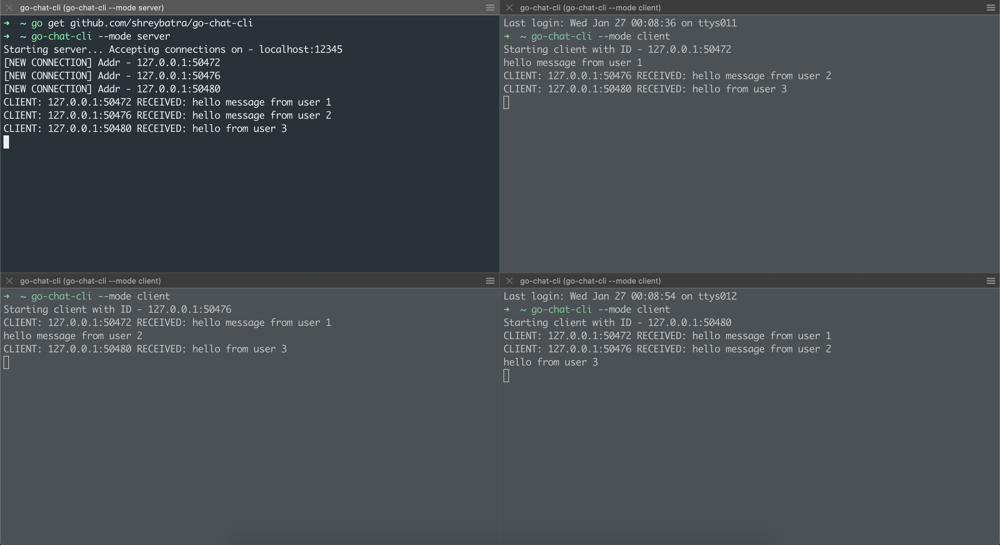

# Go Chat CLI
### A simple CLI tool implementing a low level PUB/SUB system in Golang.

This package implements a chat system using a low level PUB/SUB single channel system. This is a simple version having a single channel system, which will be further enhanced later.

The application works as a PUB/SUB system using Goroutines and Channels. The message sent from a client (publisher) is routed to each other client (subscriber) on demand, without storing/persisting and information.



## How to run your application
1. Install the application via - `go get github.com/shreybatra/go-chat-cli`
2. Start the server - `go-chat-cli --mode server` (default mode is Server only.)
3. Now you can open multiple other terminals and run clients in each - `go-chat-cli --mode client`
4. You can type any string and send a message to the chat. Each other client except the sender will receive the message.

## Configuration
By default, the server application runs on port `12345` and binds only to `localhost (127.0.0.1)`. You can customize this by setting the ENV variables -
- PORT
- HOSTS (eg 0.0.0.0)

For clients, pass the HOSTS as the IP of server application (if on different hosts).

Alternatively, you can also have a `.env` file in the current directory where you run your servers / clients. Sample .env - 
```
PORT=30080
HOSTS=0.0.0.0
```
For server, this will bind the server to HOSTS and PORT, whereas the clients would have a different value of the server's IP addr.